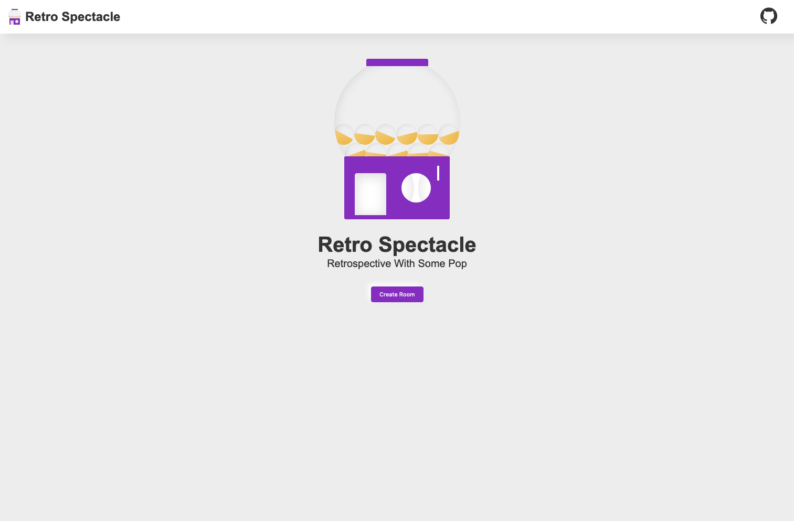
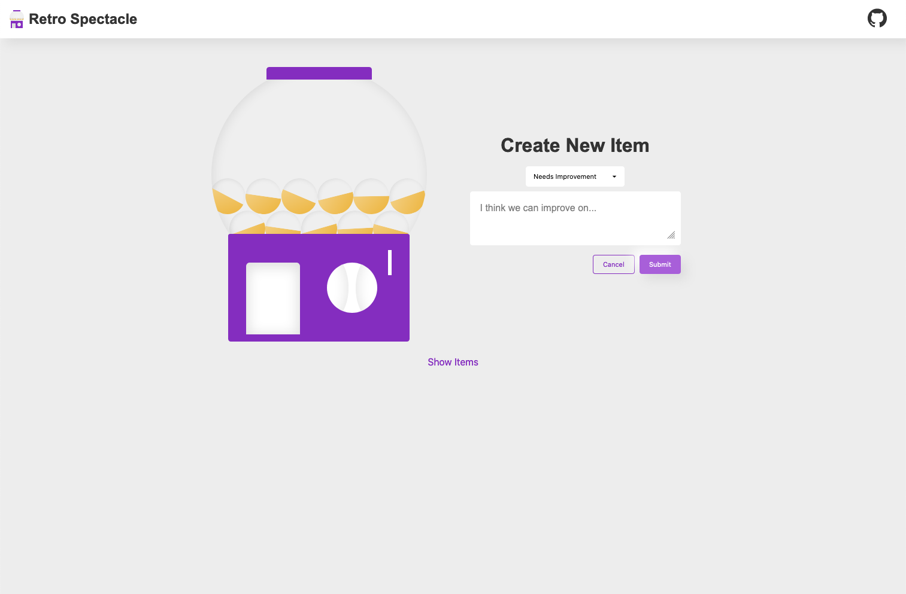
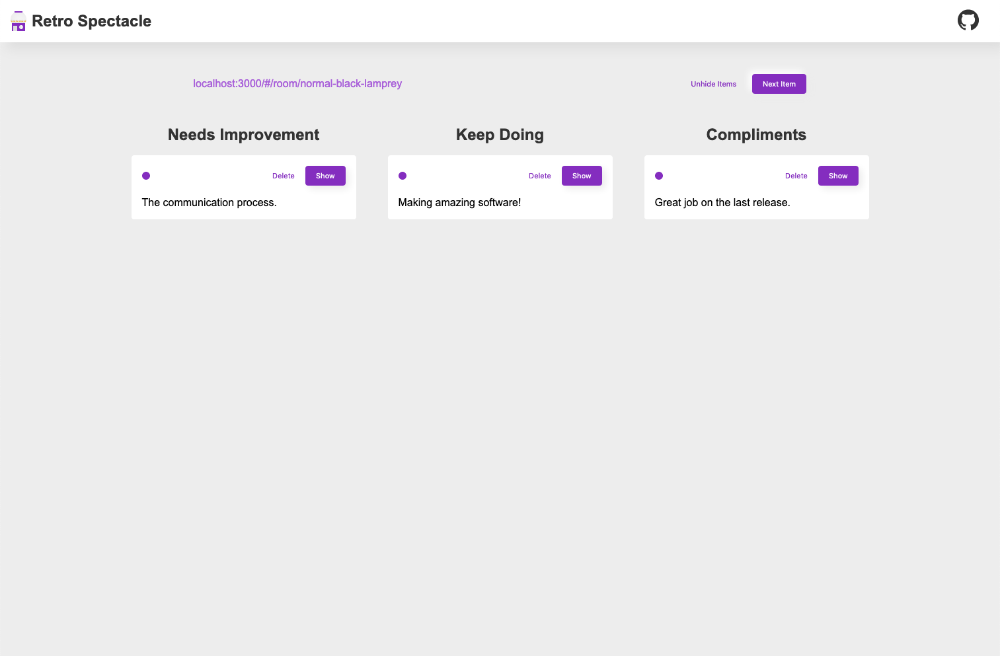

# retrospectacle.app

## Screenshots





## Development

To start a local development environment, run the following commands:

```shell
# Clone repository (or your fork)
git clone git@github.com:jakehamilton/retrospectacle.app.git

# Change directory into the project
cd retrospectacle.app

# Install dependencies
npm install

# Start development environment
npm run dev
```

For more information on contributing, see [CONTRIBUTING.md](./CONTRIBUTING.md).
